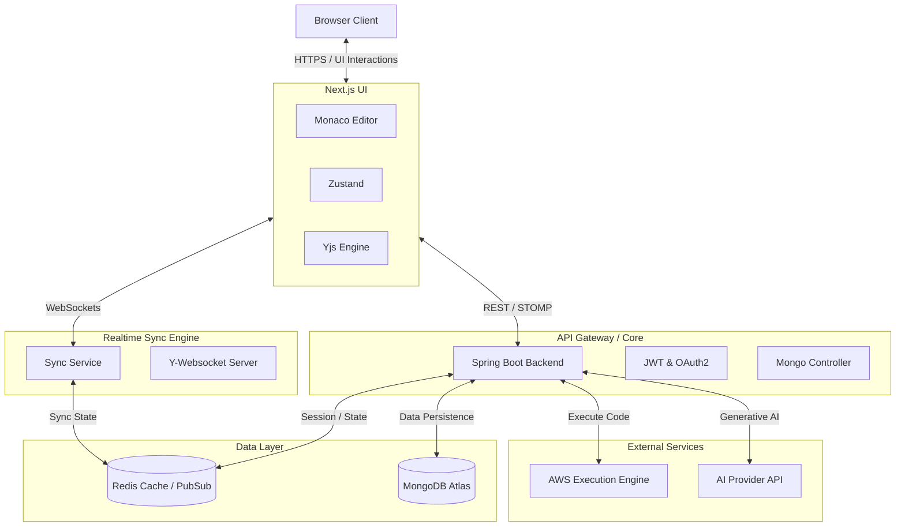

# 🚀 CollabCode – AI-Powered Developer Collaboration Platform

> An enterprise-grade, real-time collaborative coding environment built for modern remote teams.

Inspired by Cursor, VS Code, Replit, and Live Share, CollabCode provides an immersive, multi-file workspace where developers can write, execute, and discuss code simultaneously with sub-millisecond latency.

### 🌐 Live Demo
👉 **[Try CodeCollab Now!](https://codecollab-phi.vercel.app)** 

---

## 📸 Screenshots

| Dashboard | Workspace | Editor |
| :---: | :---: | :---: |
|  |  |  |

| Chat & Comm | Video Call | AI Assistant |
| :---: | :---: | :---: |
|  |  |  |

---

## ✨ Features

### Workspace & Realtime Collaboration
* **Multi-File Workspace:** VS Code-style file tree, tabs, and multi-file editing built on top of Monaco Editor.
* **Realtime Synchronization:** CRDT-powered conflict-free edits with Yjs and live cursors.
* **Separation of Concerns:** Realtime state is managed purely in memory via Redis and Sync Service, while persistent document storage is flushed asynchronously to MongoDB.

### Developer Experience & Code Execution
* **Remote Code Execution:** Secure, containerized remote execution mapped to an external AWS Execution Engine.
* **Saved Codes:** Persist, manage, and retrieve snippets via the Saved Codes modal.
* **Command Palette:** Quick-action keyboard accessible command interface.

### Communication & Collaboration
* **Real-time Chat:** STOMP-based messaging integrated directly into the workspace panel.
* **Video/Audio Calling:** Native WebRTC peer-to-peer video streaming for live pair programming.
* **Notifications:** Real-time presence and notification bells.

### AI Integration
* **Context-Aware Assistance:** Integrated AI assistant interacting with your active codebase.
* **Refactoring & Generation:** Backend capabilities to invoke LLM endpoints dynamically.

### Authentication & Security
* **JWT & OAuth2:** Stateless authentication supporting email/password and social login (Google, GitHub).
* **Role-Based Access Control:** Secure room entry, owner permissions, and execution boundaries.

---

## 🛠 Tech Stack

### Frontend
* **Framework:** Next.js, React, TypeScript
* **State & Styling:** Zustand, Tailwind CSS, Shadcn UI
* **Editor:** Monaco Editor (`@monaco-editor/react`)
* **Realtime:** Yjs, `y-monaco`, `y-websocket`

### Backend
* **Core:** Java 21, Spring Boot 3
* **Security:** Spring Security, JWT (`jjwt`)
* **Realtime Messaging:** Spring WebSocket (STOMP)
* **Build Tool:** Gradle

### Sync Service
* **Runtime:** Node.js, Express, TypeScript
* **Engine:** `y-websocket`, `ws`

### Infrastructure & Databases
* **Primary Database:** MongoDB Atlas (Spring Data MongoDB)
* **Cache & PubSub:** Redis (Spring Data Redis, `ioredis`)
* **DevOps:** Docker, Docker Compose
* **External Services:** AWS Execution Engine

---

## 🏗 Architecture



**Service Overview:**
* **Frontend:** Serves the interactive React application.
* **Backend:** Handles core business logic, persistence, RBAC, API integrations, and chat messaging.
* **Sync Service:** A dedicated, lightweight Node.js WebSocket server running `y-websocket` to exclusively handle CRDT synchronization at high frequency without blocking the Java backend.
* **Redis:** Acts as a session store and the central Pub/Sub backbone connecting instances.
* **MongoDB Atlas:** The persistent source of truth for user profiles, room metadata, saved codes, and archived chat history.

---

## 📂 Folder Structure

```text
collabcode/
├── backend/                  # Java 21, Spring Boot 3 API
│   ├── src/main/java/com/collabcode/
│   │   ├── ai/               # AI integrations
│   │   ├── auth/             # JWT & OAuth2 Security
│   │   ├── chat/             # STOMP messaging & notifications
│   │   ├── config/           # App configurations
│   │   ├── execution/        # AWS Execution Engine bindings
│   │   ├── internal/         # Internal API endpoints
│   │   └── room/             # Workspace & File CRUD
│   ├── build.gradle          # Gradle build script
│   └── Dockerfile
├── frontend/                 # Next.js Application
│   ├── components/           # UI Components (Editor, Chat, WebRTC)
│   ├── package.json          
│   └── Dockerfile
├── sync-service/             # Node.js CRDT WebSocket Server
│   ├── src/                  
│   ├── package.json
│   └── Dockerfile
└── docker-compose.yml        # Local infrastructure definition
```

---

## 🚀 Installation & Setup

### Prerequisites
* **Java 21**
* **Node.js (v18+)**
* **Docker & Docker Compose**
* **Git**

### 1. Environment Variables
Create a `.env` file at the root.

```env
# Backend & General
MONGODB_URI=mongodb+srv://<user>:<pass>@cluster.mongodb.net/collabcode
JWT_SECRET=your_super_secret_jwt_key
JWT_EXPIRATION=900
SERVICE_JWT_SECRET=internal_service_auth_key

# Execution & AI
EXECUTION_ENGINE_URL=https://your-aws-engine.example.com
EXECUTION_ENGINE_API_KEY=your_engine_key

# OAuth2 (Optional)
GOOGLE_CLIENT_ID=your_google_id
GOOGLE_CLIENT_SECRET=your_google_secret
GITHUB_CLIENT_ID=your_github_id
GITHUB_CLIENT_SECRET=your_github_secret

# Sync Service
PORT=1234
REDIS_URL=redis://localhost:6379

# Frontend
NEXT_PUBLIC_API_BASE_URL=http://localhost:8080/api/v1
NEXT_PUBLIC_SYNC_WS_URL=ws://localhost:1234
NEXT_PUBLIC_STOMP_WS_URL=ws://localhost:8080/ws
```

### 2. Running the Project (Locally)

**Clone the repository:**
```bash
git clone https://github.com/yourusername/collabcode.git
cd collabcode
```

**Start the Infrastructure (Redis):**
```bash
docker compose up -d redis
```

**Start the Backend:**
```bash
cd backend
./gradlew bootRun
```

**Start the Sync Service:**
```bash
cd sync-service
npm install
npm run dev
```

**Start the Frontend:**
```bash
cd frontend
npm install
npm run dev
```

### 3. Build & Test Commands

**Backend (Gradle):**
```bash
./gradlew clean         # Clean build artifacts
./gradlew build         # Compile and package application
./gradlew test          # Run unit tests
```

**Frontend (NPM):**
```bash
npm run build           # Build production bundle
npm run lint            # Run TypeScript typechecks
npm run test            # Run Vitest tests
```

---

## 📡 API Overview

* **Authentication (`/api/v1/auth`)**: Login, Signup, OAuth callbacks, Token validation.
* **Rooms (`/api/v1/rooms`)**: Create, join, and manage collaborative workspaces.
* **Files (`/api/v1/files`)**: CRUD operations for the file tree state.
* **Saved Codes (`/api/v1/saved-codes`)**: Persist personal code snippets.
* **Execution (`/api/v1/execution`)**: Submit code blocks to the AWS Execution Engine.
* **AI (`/api/v1/ai`)**: Prompt and contextual code generation endpoints.
* **Health (`/api/v1/health`)**: Actuator-style readiness checks.

---

## ⚡ Realtime Collaboration Architecture

CollabCode implements a robust CRDT (Conflict-free Replicated Data Type) architecture tailored for code editing:

1. A user types in the **Monaco Editor**.
2. **Yjs** calculates the exact delta of the change.
3. The delta is pushed via WebSockets to the lightweight **Sync Service** (`y-websocket`).
4. The Sync Service immediately broadcasts the delta to all other **Connected Clients**.
5. Concurrently, state updates are propagated through **Redis** to ensure multi-node scalability.
6. The Spring Boot backend asynchronously pulls snapshots of the document state to persist to **MongoDB Atlas**, intentionally keeping disk I/O out of the critical realtime loop.

---

## 🚢 Deployment

The application is fully containerized and intended for cloud deployment.
* **Docker Compose:** The root `docker-compose.yml` ties the frontend, backend, sync-service, and Redis together for single-node deployments.
* **State:** MongoDB is hosted externally on **MongoDB Atlas** for high availability.
* **Remote Execution:** Code runs isolated on the **AWS Execution Engine** to protect the primary backend from malicious payloads.
* **Builds:** The backend is packaged entirely via the **Gradle Wrapper**, ensuring repeatable Docker builds without requiring host dependencies.

---

## 🧪 Testing
* **Backend:** Comprehensive unit testing utilizing JUnit 5 and Mockito (executed via `./gradlew test`). JaCoCo is integrated for test coverage reporting.
* **Frontend:** Vitest for component logic and Playwright configured for E2E workflows.

---

## 🔒 Security
* **Authentication:** Stateless JWT verification on every protected route.
* **Authorization:** Strict RBAC limits room mutations to Room Owners and restricts execution based on quotas.
* **Data Validation:** Zod validates all incoming UI forms; Spring Validation handles backend DTO sanitization.

---

## 🚀 Performance
* **Incremental Builds:** Powered by the recent migration to Gradle, backend compilation caches heavily reduce CI times.
* **WebSocket Isolation:** High-frequency typing events are offloaded to Node.js, ensuring the Java backend never bottlenecks on character-by-character events.
* **Lazy Loading:** Frontend component code-splitting via Next.js dynamically loads heavy dependencies (like Monaco Editor).

---

## 🛣 Roadmap

### Completed
* [x] Basic multi-file editing
* [x] CRDT real-time synchronization
* [x] STOMP Chat integration
* [x] Gradle Build System Migration
* [x] AWS Execution Engine binding
* [x] WebRTC Video/Audio

### In Progress
* [ ] Multi-cursor performance enhancements
* [ ] Advanced AI autocomplete UI binding

### Planned
* [ ] WebAssembly offline execution mode
* [ ] Advanced language servers (LSP) integration

---

## 🤝 Contributing
1. Fork the repository
2. Create your feature branch (`git checkout -b feature/amazing-feature`)
3. Ensure backend code builds (`./gradlew build`) and tests pass (`./gradlew test`)
4. Commit your changes (`git commit -m 'Add amazing feature'`)
5. Push to the branch (`git push origin feature/amazing-feature`)
6. Open a Pull Request

---

## 📄 License
This project is licensed under the MIT License.
