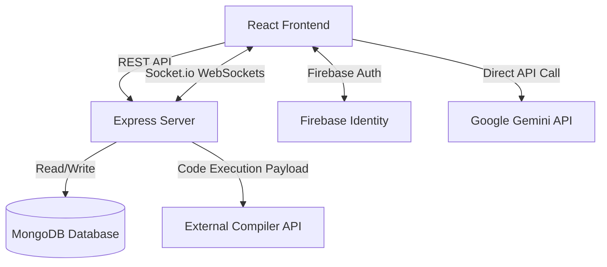
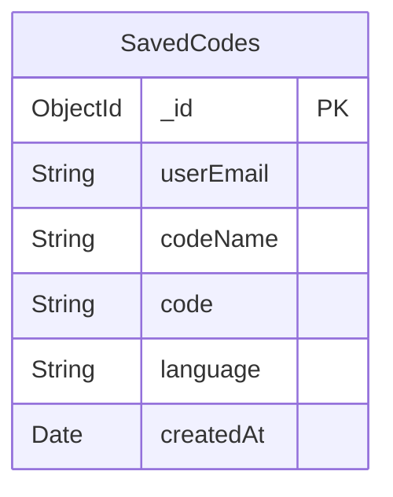

# Complete Project Analysis: Coding Collaborator

This document provides a comprehensive technical analysis of the **Coding Collaborator** project based on the complete source code review.

---

## 1. Project Overview

- **What is this project?**
  "Coding Collaborator" (CodeFuse) is a real-time web-based code editor and collaboration platform that allows multiple developers to write, execute, and save code together in virtual rooms.
- **What problem does it solve?**
  It removes the friction of setting up local environments for pair programming or technical interviews by providing a zero-setup, shareable online IDE with built-in execution and AI assistance.
- **Who are the target users?**
  Students, educators, developers pairing on bugs, and technical interviewers/interviewees.
- **Core purpose of the application:**
  To facilitate seamless, real-time code collaboration with AI-assisted completions and integrated code execution.
- **Main workflow of the platform:**
  User logs in via Google -> Creates or joins a Room via a unique ID -> Enters the Code Editor -> Writes code with real-time AI suggestions and live synchronization with peers -> Runs code -> Saves code to their profile.

---

## 2. Feature Analysis

| Feature Name | Description | Current Status | Files Involved | Dependencies | Internal Working |
| :--- | :--- | :--- | :--- | :--- | :--- |
| **Real-Time Collaboration** | Live syncing of code between multiple users in a room. | Complete (Naive) | `server/index.js`, `EditorPage.js`, `Editor.js`, `Socket.js` | `socket.io`, `socket.io-client` | Frontend captures CodeMirror `change` events and emits `CODE_CHANGE` via WebSockets. Backend broadcasts the entire code string to the room. |
| **AI Code Suggestions** | Context-aware code auto-completion using Google Gemini. | Complete | `Editor.js` | `@google/generative-ai` | Debounced fetching of completions via Gemini API based on cursor position and code context. Shown as a custom dropdown menu. |
| **Code Execution** | Compiling and running code. | Complete | `EditorPage.js`, `server/index.js` | `axios`, 3rd-party Compiler API | Code is sent to a backend proxy (`/api/execute`), which forwards it to an external execution API (likely Piston or Judge0 based on the payload). |
| **Code Saving/Management** | Saving snippets to a DB tied to the user's email. | Complete | `EditorPage.js`, `server/index.js` | `mongodb`, `firebase/auth` | User saves code to `/api/save-code`. Backend stores it in MongoDB under the user's email. |
| **Google Authentication** | Logging in via Google. | Complete | `Home.js`, `firebase.js` | `firebase` | Firebase Auth popup is triggered. Client stores the `userEmail` and photo URL in state/routing context. |
| **Room Management** | Generating random UUIDs for session sharing. | Complete | `Home.js` | `uuid` | Client generates a UUID, users copy and share it to join the same Socket.io room. |
| **Active Users List** | Sidebar showing who is currently in the room. | Complete | `EditorPage.js`, `Client.js`, `server/index.js` | `socket.io` | Backend maintains a `userSocketMap`. On join/disconnect, backend broadcasts the updated list of users to the room. |

---

## 3. User Flow Analysis

### Authentication Flow
1. User visits `/` (Home Page).
2. Clicks "Sign in with Google".
3. Firebase popup appears (`signInWithPopup`).
4. On success, `username`, `email`, and `photoURL` are saved in React state (`Home.js`).

### Main User Journey
1. After login, user clicks "Create Room" -> generates UUID.
2. User clicks "Join" -> Navigates to `/editor/:roomId` passing user details via React Router state.
3. `EditorPage` initializes socket connection -> Emits `JOIN` event.
4. Server acknowledges and broadcasts `JOINED` to all room members.
5. `EditorPage` fetches existing code from peers via `SYNC_CODE`.

### Real-time Collaboration Flow
1. User types in CodeMirror (`Editor.js`).
2. `change` event triggers -> debounced `CODE_CHANGE` event emitted to server.
3. Server broadcasts `CODE_CHANGE` to everyone else in `roomId`.
4. Peer receives `CODE_CHANGE` -> calls `editor.setValue()` to update the UI and resets cursor position.

### Session Management Flow
- Handled entirely via WebSockets connection lifecycle. Disconnecting the socket triggers the `disconnecting` event on the server, which alerts remaining peers and removes the user from the sidebar.

---

## 4. Architecture Analysis

- **Frontend Architecture:** Client-side React SPA. Uses functional components and React hooks. State is mostly local, managed via `useState` and `useRef`. Routing via `react-router-dom`.
- **Backend Architecture:** Monolithic Node.js/Express server. Handles static REST endpoints and Socket.io WebSocket connections simultaneously on the same HTTP server.
- **Database Architecture:** Single MongoDB database (`CodeCollab`) with a single collection (`SavedCodes`).
- **Real-time Communication:** Socket.io pub/sub model using rooms.
- **API Layer:** Express handles REST API for database operations (`/api/save-code`, `/api/saved-codes/:userEmail`) and acts as a proxy to hide the external Compiler API key (`/api/execute`).

### System Architecture Diagram

---

## 5. Folder Structure Breakdown

- **`/client` (Frontend Application)**
  - **Responsibility:** User interface, state management, and real-time socket connections.
  - **Components:** `Home.js`, `EditorPage.js`, `Editor.js`, `Client.js`.
  - **Design Patterns:** Container/Presentational (partially). Heavy reliance on `useEffect` for lifecycle mapping.
  - **Coupling:** High coupling in `EditorPage.js` (handles API calls, Socket logic, and UI state).
- **`/server` (Backend Application)**
  - **Responsibility:** API routing, WebSocket signaling, and DB interactions.
  - **Components:** `index.js` (monolith), `Actions.js` (constants).
  - **Design Patterns:** Standard Express middleware pattern.
  - **Coupling:** All logic resides in `index.js`. No separation of concerns (Routes, Controllers, Services are all bundled).

---

## 6. Technology Stack Analysis

| Technology | Version | Purpose | Evaluation / Alternatives |
| :--- | :--- | :--- | :--- |
| **React** | 18.2.0 | Frontend UI | Solid choice. Next.js could offer better SEO and server-side rendering. |
| **CodeMirror** | 5.65.19 | Code Editor | Good, but outdated (v5). **Monaco Editor** or CodeMirror v6 would provide better performance and VS Code-like intellisense. |
| **Socket.io** | 4.7.2 | Real-time sync | Excellent for this use case. Provides built-in fallback and room management. |
| **Firebase Auth**| 11.8.0 | Authentication | Simple and effective. |
| **Node / Express**| 4.19.2 | Backend API | Standard and reliable. |
| **MongoDB** | 6.17.0 | Database | Flexible. Suitable for storing unstructured code snippets. |
| **Gemini API** | 0.24.1 | AI Suggestions | Fast and powerful. Calling it directly from the frontend exposes the API key if not careful (currently relies on `REACT_APP_GEMINI_API_KEY`). |

---

## 7. API Analysis

| Endpoint | Method | Request Body / Params | Response | Auth Required? | Description |
| :--- | :--- | :--- | :--- | :--- | :--- |
| `/api/save-code` | `POST` | `{ userEmail, codeName, code, language }` | `{ message: "Code saved" }` | **NO (Vulnerability)** | Saves code to DB. |
| `/api/saved-codes/:userEmail` | `GET` | Params: `userEmail` | `[ { _id, codeName, code, language... } ]` | **NO (Vulnerability)** | Fetches saved snippets for a user. |
| `/api/delete-code/:id` | `DELETE`| Params: `id` | `{ message: "Code deleted" }` | **NO (Vulnerability)** | Deletes snippet by ID. |
| `/api/execute` | `POST` | `{ language, version, files, stdin }` | `{ run: { output: "..." } }` | No | Proxies request to an external compiler. |

---

## 8. Database Analysis

- **Database Type:** MongoDB (NoSQL)
- **Collections:** `SavedCodes`
- **Schema:** Dynamic. Typically contains `userEmail`, `codeName`, `code`, `language`, `createdAt`.
- **Indexes:** Unique compound index on `{ userEmail: 1, codeName: 1 }` to prevent duplicate code names for the same user.
- **Performance Risks:** Because `code` is a large string, doing wildcard searches (if implemented later) would be slow. No pagination on the `GET` request.

### ER Diagram

---

## 9. Real-Time Collaboration Analysis

- **Implementation:** Socket.io with Room-based routing.
- **Message Flow:** User types -> `CODE_CHANGE` event containing the **entire code string** is emitted -> Server broadcasts string -> Peer receives and calls `editor.setValue()`.
- **Bottlenecks & Critical Flaws:**
  - **Naive Synchronization:** Sending the entire document on every keystroke is highly inefficient for large files.
  - **Conflict Resolution (Missing):** There is no Operational Transformation (OT) or CRDT implementation. If two users type at the exact same millisecond, a race condition occurs, and one user's code will forcefully overwrite the other's.
  - **Cursor Jumping:** When `editor.setValue(code)` is called on the receiving end, the receiver's cursor position is reset. The code attempts to mitigate this by storing and restoring the cursor, but this breaks if the incoming text shifts the document length.
  - **Undo Stack Destruction:** Calling `setValue()` clears the CodeMirror undo history for peers.
- **Presence Tracking:** Works well, bound to socket connect/disconnect lifecycle. Live cursor tracking is **not** implemented.

---

## 10. Authentication & Security Analysis

**Severity: CRITICAL**

The application has a massive security flaw in its API architecture.

| Security Issue | Severity | Description | Fix |
| :--- | :--- | :--- | :--- |
| **Missing Backend Authorization** | **Critical** | Firebase Auth is only verified on the frontend. The backend `/api/saved-codes/:userEmail` trusts any email passed in the URL or Body. A malicious user can fetch, overwrite, or delete ANY user's saved code using Postman by simply guessing their email. | Pass a Firebase ID Token in the `Authorization: Bearer <token>` header and verify it on the backend using `firebase-admin`. |
| **API Key Exposure** | **High** | The Gemini API key (`REACT_APP_GEMINI_API_KEY`) is stored in the frontend environment. Any user can open Chrome DevTools, extract the key, and use your quota. | Move the Gemini API call to the Node.js backend. |
| **No Rate Limiting** | **Medium** | The `/api/execute` endpoint proxies to an external compiler. Without rate limiting, a malicious user could DDoS your endpoint, depleting your compiler quota and crashing the server. | Implement `express-rate-limit`. |
| **Injection Risks** | **Low** | MongoDB queries are relatively safe as they use explicit object creation, but `userEmail.trim()` assumes strings without deep validation. | Add schema validation (e.g., Zod or Joi). |

---

## 11. Code Quality Review

**Score: 5/10**

- **Maintainability:** Poor backend maintainability. All routes, DB connections, and socket logic are stuffed into a single 289-line `server/index.js` file.
- **Reusability:** Frontend components are somewhat monolithic. `EditorPage.js` handles too much logic (850+ lines).
- **Design Patterns:** Lacks separation of concerns.
- **Error Handling:** Basic `console.error` and `toast.error`. Express has a global error handler, but specific async route errors could cause unhandled promise rejections if not strictly caught (though try/catches are present).
- **Styling:** CSS is injected inline using `<style>` tags directly inside React components (`Home.js`, `EditorPage.js`), which makes the JSX incredibly bloated and hard to read.

---

## 12. Performance Analysis

- **Websocket Bottleneck:** Broadcasting full file contents on every keystroke (`O(N)` network overhead where N is file size). For a 10KB file with 5 users typing fast, this causes massive network spam.
- **Unnecessary Re-renders:** In `EditorPage.js`, `clients` are passed down. Setting state triggers re-renders. The `debouncedSetClients` helps, but better state management is needed.
- **Memory Leaks:** The WebSocket listeners are correctly cleaned up in `EditorPage.js` (`return () => socketRef.current.off()`), which is good. However, CodeMirror instance cleanup might fail edge cases if hot-reloaded.

---

## 13. DevOps & Deployment Analysis

- **Deployment:** Split deployment (Vercel for Frontend, Render for Backend).
- **Cold Starts:** Render free tier spins down after 15 mins. The developer added a clever self-ping hack (`setInterval` hitting `/health`) in `index.js` to prevent cold starts.
- **Configuration:** Handled via `.env`.
- **Missing:** No Dockerfile, no `docker-compose.yml`, no GitHub Actions for CI/CD. The application cannot be scaled horizontally easily because `userSocketMap` and Socket.io rooms are stored in memory on a single Node instance (No Redis Adapter).

---

## 14. Testing Analysis

- **Unit Tests:** None implemented (only the default CRA `App.test.js` exists).
- **Integration Tests:** None.
- **E2E Tests:** None.
- **Recommendation:** Need Jest tests for Socket event emitting/receiving, and API route tests using Supertest.

---

## 15. Missing Features & Roadmap Opportunities

1. **True Collaborative Editing (CRDTs):** Implement Yjs to handle conflict resolution and simultaneous typing safely.
2. **Live Cursors:** Show where other users are currently typing.
3. **Backend Auth Verification:** (Mandatory for security).
4. **Chat Box:** A simple text chat in the room sidebar.
5. **Multiple Files / File Tree:** Support for multi-file projects instead of a single scratchpad.
6. **Code Diffing:** Only send text deltas over WebSockets instead of the full payload.

---

## 16. Resume Value Analysis

**Is this project strong enough for placements?** Yes, but with caveats.

- **Tier-3 College Resume Impact:** **9/10**. It looks visually impressive, integrates AI, and features WebSockets which recruiters love.
- **Product Company Impact:** **7/10**. Good concept, but senior engineers interviewing you will immediately point out the Naive text sync and security flaws.
- **Startup Impact:** **8/10**. Shows you can stitch together complex APIs rapidly.
- **FAANG-Level Relevance:** **5/10**. The lack of CRDTs (Operational Transformation), missing backend security, and single-file architecture will be exposed in deep technical rounds.

**Score: 7.5/10**

---

## 17. Interview Preparation Section

If you put this on your resume, prepare for these exact questions:

**Q: How did you handle conflicts when two people type at the exact same time?**
*Honest Answer based on code:* "Currently, it uses a naive approach: the last event received overwrites the editor state via `setValue()`. For a production version, I would integrate a CRDT (Conflict-free Replicated Data Type) library like `Yjs` to merge text deltas deterministically."

**Q: Is your application secure? How are you protecting the saved codes?**
*Answer:* "Currently, authentication is handled client-side via Firebase. However, to make it production-secure, I need to pass the Firebase JWT to the backend Express server and verify it using Firebase Admin SDK before allowing database reads/writes."

**Q: Why does your Gemini API call happen on the frontend?**
*Answer:* "For rapid prototyping, I initialized the SDK on the client. In a real-world scenario, this exposes the API key. The next step is to move the Gemini logic to a backend `/api/autocomplete` endpoint."

**Q: How would you scale this application horizontally across multiple servers?**
*Answer:* "Right now, Socket.io rooms are stored in memory. If I spin up a second backend instance, users on Server A cannot sync with users on Server B. I would need to implement the `@socket.io/redis-adapter` to share events across nodes via Redis pub/sub."

---

## 18. Production Readiness Audit

**Readiness Score: 40/100 (Not Production Ready)**

- **Missing:** Backend auth validation, API rate limiting, CRDTs for text synchronization, Redis adapter for scaling, proper separation of concerns in Express.
- **Risks:** The database can be freely manipulated by anyone who knows how to format an HTTP request.
- **Technical Debt:** Huge CSS blocks inside React components. No tests.

---

## 19. Executive Summary

- **Top Strengths:** Excellent visual aesthetics, great feature integration (Gemini + Compiler + WebSockets), and a very smooth user experience for a solo/paired demo.
- **Top Weaknesses:** Total lack of backend security validation, naive websocket payload synchronization, and exposed API keys.
- **Top Risks:** Anyone can delete the entire database. High cost risk if the exposed Gemini API key is scraped.
- **Top Opportunities:** Refactoring the editor to use Yjs with Monaco Editor would transform this from a "student project" into a highly sophisticated, enterprise-level application.

---

## 20. Final Verdict

- **Overall Architecture Score:** 6/10
- **Scalability Score:** 4/10
- **Security Score:** 2/10
- **Code Quality Score:** 5/10
- **Resume Score:** 8/10
- **Production Readiness Score:** 4/10

### Answers to your specific questions:

1. **What exactly has been built?** A real-time, shared code editor with AI completions and integrated execution.
2. **What is currently working?** Sockets, Authentication (UI side), DB saving, AI suggestions, and Code execution.
3. **What is partially working?** Real-time collaboration. It works visibly but will break/stutter under heavy simultaneous typing due to full-string overwrites.
4. **What is broken?** Security. API endpoints are completely open.
5. **What should be fixed first?** **CRITICAL:** Move Gemini API calls to the backend to protect your API key. Implement Firebase Admin on the backend to secure the `/api/save-code` routes.
6. **What should be built next?** Integrate `yjs` (CRDT) to fix the cursor reset and synchronization issues.
7. **Is this project strong enough for placements?** Yes, it is a fantastic project that hits multiple domains (AI, Sockets, Auth). However, you MUST be able to explain its flaws (like the lack of CRDTs) to interviewers to show maturity.
8. **Is this project worthy of being a flagship resume project?** Yes. Fix the security issues, separate your backend routes, and this will easily be a standout project.
